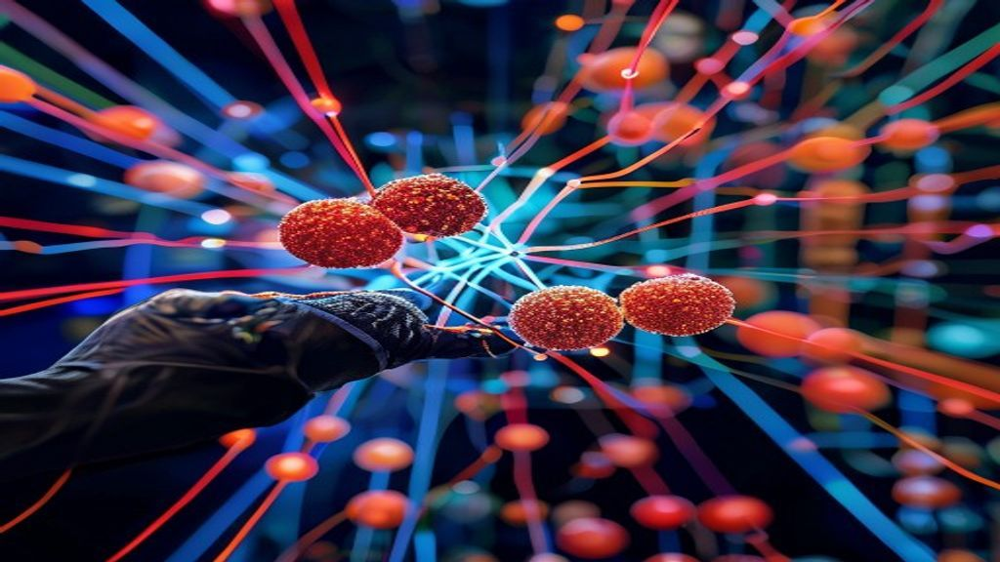

# Self Attention in Transformer Architecture

## Introduction to Transformers
Transformers are a type of neural network architecture introduced for natural language processing tasks. The architecture of a Transformer model consists of an encoder and a decoder, each comprising a stack of identical layers. 
* The encoder takes in a sequence of tokens and outputs a sequence of vectors.
* The decoder generates output sequences, one token at a time, based on the output vectors from the encoder.
The role of self-attention in Transformer models is to allow the model to attend to different parts of the input sequence simultaneously and weigh their importance. 
This is particularly useful for tasks that require understanding the relationships between different parts of the input sequence.
The advantages of using Transformers over traditional recurrent neural networks include:
* Parallelization of computations, making them much faster to train.
* Ability to handle long-range dependencies more effectively.
* State-of-the-art results in many natural language processing tasks.

## Self-Attention Mechanism
The self-attention mechanism is a core component of Transformer models, allowing them to weigh the importance of different input elements relative to each other. 
* The concept of query, key, and value vectors is fundamental to self-attention: the query vector represents the context in which the attention is being applied, the key vector represents the input elements being considered, and the value vector represents the importance of each input element.
* The process of computing attention weights involves taking the dot product of the query and key vectors, applying a softmax function to obtain a set of weights that sum to 1, and then using these weights to compute a weighted sum of the value vectors.
* Scaling is crucial in self-attention, as it helps to prevent the dot products from growing too large, which can lead to extremely small gradients during backpropagation, making training difficult: this is typically achieved by dividing the dot products by the square root of the dimensionality of the key vectors.

*Self-Attention Mechanism*

## Multi-Head Attention
Multi-head attention is a key component of the Transformer architecture, allowing the model to jointly attend to information from different representation subspaces. Unlike single-head attention, which applies a single attention function to the input, multi-head attention applies multiple attention heads in parallel. 
* The concept of multi-head attention and how it differs from single-head attention lies in its ability to capture different types of relationships between input elements.
* The process of applying multiple attention heads involves linearly transforming the input into multiple attention heads, applying attention to each head, and then concatenating the results.
* The advantages of using multi-head attention over single-head attention include increased capacity to capture complex relationships and improved performance on tasks that require simultaneous attention to multiple aspects of the input.

*Multi-Head Attention*

## Edge Cases and Failure Modes
Self-attention mechanisms in Transformer architectures can be prone to certain edge cases and failure modes. 
* Zero-padding can significantly impact self-attention, as it may lead to the model attending to padded tokens, resulting in wasted computation and potentially affecting performance.
* Using large input sequences can also affect self-attention, as it increases the computational complexity and memory requirements, potentially leading to slower processing times and higher memory usage.
* Additionally, using self-attention in low-resource languages can be problematic, as the model may not have enough training data to effectively learn the language patterns, resulting in suboptimal performance.

## Code Implementation
To implement the self-attention mechanism using PyTorch, we can utilize the `nn.Module` and `nn.Parameter` classes. Here's a minimal code sketch:
```python
import torch
import torch.nn as nn
import torch.nn.functional as F

class SelfAttention(nn.Module):
    def __init__(self, embed_dim, num_heads):
        super(SelfAttention, self).__init__()
        self.embed_dim = embed_dim
        self.num_heads = num_heads
        self.query_linear = nn.Linear(embed_dim, embed_dim)
        self.key_linear = nn.Linear(embed_dim, embed_dim)
        self.value_linear = nn.Linear(embed_dim, embed_dim)

    def forward(self, x):
        # Split the input into query, key, and value tensors
        query = self.query_linear(x)
        key = self.key_linear(x)
        value = self.value_linear(x)

        # Compute the attention scores
        attention_scores = torch.matmul(query, key.transpose(-1, -2)) / math.sqrt(self.embed_dim)

        # Compute the weighted sum of the value tensor
        attention_weights = F.softmax(attention_scores, dim=-1)
        output = torch.matmul(attention_weights, value)

        return output
```
The key components of this implementation are the `query_linear`, `key_linear`, and `value_linear` layers, which transform the input tensor into query, key, and value tensors, respectively. The `forward` method computes the attention scores by taking the dot product of the query and key tensors, and then applies the softmax function to obtain the attention weights. 
* Proper initialization of the linear layers is crucial for the self-attention mechanism to work correctly. 
* Hyperparameter tuning, such as choosing the optimal number of heads and embedding dimension, is also essential for achieving good performance. 
By carefully tuning these hyperparameters and initializing the layers properly, we can effectively utilize the self-attention mechanism in our Transformer architecture.

## Performance and Cost Considerations
The self-attention mechanism in Transformer architecture has significant implications for performance and cost. 
* The computational complexity of self-attention is a major consideration, as it involves computing attention weights for every pair of tokens in the input sequence, resulting in a time complexity of O(n^2), where n is the sequence length.
* The memory requirements for self-attention are also substantial, as the attention weights and intermediate results need to be stored, which can lead to high memory usage for long input sequences.
* The potential impact on training time and inference speed is significant, as the self-attention mechanism can become a bottleneck in the overall processing pipeline, particularly for large models and long input sequences, leading to increased training times and slower inference speeds. 
To mitigate these costs, developers can explore techniques such as sparse attention, attention pruning, or knowledge distillation to reduce the computational complexity and memory requirements of self-attention mechanisms.

*Performance and Cost Considerations*

## Debugging and Observability
To effectively debug and monitor self-attention mechanisms, several key strategies can be employed. 
* Visualizing attention weights is crucial as it allows developers to understand how the model is focusing on different parts of the input data. 
* Using tools like TensorBoard can facilitate the debugging process of self-attention by providing a graphical representation of the model's performance and attention weights. 
* Logging and monitoring play a significant role in self-attention mechanisms, enabling developers to track the model's behavior and identify potential issues during training and inference.